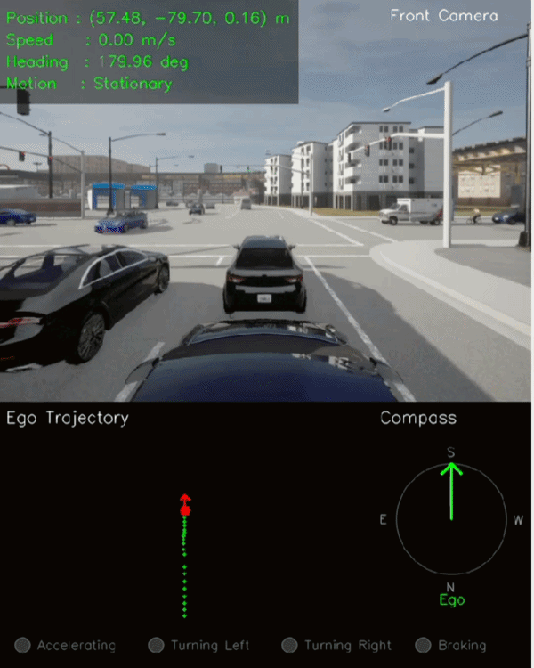

# 11A — Ego Motion Estimation

## Objective

Develop an **ego motion estimation pipeline** by combining synchronized Front Camera, IMU, and GNSS data to estimate the motion state of the ego vehicle.

This milestone introduces local ego-coordinate positioning, speed estimation, IMU-based acceleration and yaw-rate estimation, heading recovery, and motion-state classification within a modular ROS2 architecture and deterministic offline replay workflow.

**Question addressed:**

> **How can synchronized GNSS and IMU measurements be combined to estimate the motion state of the ego vehicle?**

---

## Architecture

```text
                 Front Camera
                      +
                     IMU
                      +
                    GNSS
                      │
                      ▼
             Synchronized Sensor Data
                      │
             ┌────────┴────────┐
             ▼                 ▼
        GNSS Pipeline      IMU Pipeline
             │                 │
             ▼                 ▼
       Local ENU Position   Acceleration
             │              Yaw Rate
             ▼              Heading
          Ego Speed            │
             │                 │
             └────────┬────────┘
                      ▼
              Motion State Estimation
                      │
                      ▼
              Ego Motion Telemetry
                      │
                      ▼
               Display Pipeline
                      │
                      ▼
          Trajectory + Motion Visualization
```

---

## Project Structure

```text
11A_ego_motion_estimation/
├── assets/
│   ├── gifs/
│   └── images/
├── config/
├── dev/
│   └── dataset_synchronizer.py
├── launch/
├── perception/
│   ├── display_pipeline.py
│   ├── ego_veh_motion.py
│   ├── gnss_pipeline.py
│   └── imu_pipeline.py
├── replay/
│   └── multi_sensors_replay.py
└── README.md
```

---

## Key Components

### Synchronized Multi-Sensor Replay

Implemented a deterministic replay pipeline for the sensor streams required for ego motion estimation.

Phase 11A uses:

- Front RGB Camera
- IMU
- GNSS

The replay node publishes the recorded sensor measurements without performing interpretation or estimation.

IMU data includes:

- Linear acceleration
- Angular velocity
- Orientation quaternion generated from the recorded CARLA compass value

GNSS data includes:

- Latitude
- Longitude
- Altitude

Completed:

- Front camera replay
- IMU replay
- GNSS replay
- Sensor timestamp handling
- Deterministic offline replay

---

### Sensor Synchronization

Synchronized Front Camera, IMU, and GNSS measurements using ROS2 `TimeSynchronizer`.

```text
Front Camera
      │
      ├──────────────┐
      │              │
     IMU            GNSS
      │              │
      └──────┬───────┘
             ▼
      TimeSynchronizer
             │
             ▼
       Synchronized Frame
```

Completed:

- Front camera synchronization
- IMU synchronization
- GNSS synchronization
- Frame-level sensor alignment

The ROS2 node remains lightweight and delegates processing to the individual pipeline classes.

---

### GNSS-Based Ego Position Estimation

Implemented local ego-position estimation by converting GNSS coordinates into a local East-North-Up (ENU) coordinate frame.

Completed:

- GNSS latitude/longitude/altitude processing
- Local ENU coordinate conversion using `pymap3d`
- First GNSS sample used as the local origin
- Ego position estimation
- Consecutive-position based speed estimation

Outputs:

```text
Ego Position
├── X
├── Y
└── Z

Ego Speed
└── m/s
```

The local coordinate representation provides a consistent frame for estimating ego displacement and trajectory.

---

### IMU Motion Estimation

Implemented IMU-based motion measurements for estimating the instantaneous motion state of the ego vehicle.

Completed:

- Linear acceleration extraction
- Yaw-rate extraction
- Heading recovery from orientation quaternion
- Motion-state estimation

Outputs:

```text
IMU Motion
├── Acceleration
├── Yaw Rate
├── Heading
└── Motion State
```

---

### Ego Motion State Classification

Implemented rule-based motion-state classification using the estimated IMU measurements.

Supported states:

```text
Stationary
Moving Forward
Accelerating
Braking
Turning Left
Turning Right
```

The classifier uses acceleration and yaw-rate thresholds to determine the current ego motion state.

For the recorded dataset, the validated yaw-rate convention is:

```text
Positive Yaw Rate → Turning Right
Negative Yaw Rate → Turning Left
```

This dataset-specific convention is retained as part of the Phase 11A implementation.

---

### Ego Motion Visualization

Implemented a dedicated visualization pipeline for displaying the estimated ego motion alongside the synchronized front camera view.

Visualization layout:

```text
┌──────────────────────────────────────┐
│                                      │
│        Front Camera + Telemetry      │
│                                      │
├──────────────────────┬───────────────┤
│                      │               │
│    Ego Trajectory    │    Heading    │
│                      │    Compass    │
│                      │               │
├──────────────────────┴───────────────┤
│     Motion-State Indicators          │
└──────────────────────────────────────┘
```

Displayed:

- Front camera
- Ego position
- Ego speed
- Ego acceleration
- Ego heading
- Ego yaw rate
- Ego trajectory
- Ego-relative heading visualization
- Motion-state indicators

The bottom status bar provides visual indicators for:

- Accelerating
- Braking
- Turning Left
- Turning Right

---

### Replay State Management

Implemented explicit state-reset handling for deterministic replay loops.

Replay restart is detected when:

```text
current_frame < previous_frame
```

When a replay restart is detected, the following pipelines are reset:

```text
GNSSPipeline
IMUPipeline
DisplayPipeline
```

This clears:

- GNSS trajectory state
- IMU state
- Trajectory history
- Motion-state indicators

This ensures that each replay begins from a clean state without carrying temporal state from the previous sequence.

---

## Software Architecture

The Phase 11A implementation follows a modular pipeline architecture.

```text
Replay Node
     │
     ▼
Sensor Synchronization
     │
     ├──────────────┐
     ▼              ▼
GNSSPipeline    IMUPipeline
     │              │
     └──────┬───────┘
            ▼
       Ego Motion Node
            │
            ▼
      DisplayPipeline
```

| Module | Responsibility |
|---|---|
| **Replay Node** | Load recorded sensor data and publish ROS2 messages |
| **DatasetSynchronizer** | Align recorded sensor frames using timestamps |
| **GNSSPipeline** | Convert GNSS to local ENU coordinates and estimate position and speed |
| **IMUPipeline** | Process acceleration, yaw rate, heading, and motion state |
| **Ego Motion Node** | Subscribe to synchronized sensors and coordinate pipeline execution |
| **DisplayPipeline** | Render camera, telemetry, trajectory, heading, and motion indicators |

The architecture keeps computation inside pipeline classes while the ROS2 node coordinates synchronized inputs and outputs.

---

## Engineering Outcome

Successfully developed an **ego motion estimation framework** combining synchronized GNSS and IMU measurements with a modular ROS2 perception architecture.

The system estimates:

- Ego position
- Ego speed
- Ego acceleration
- Ego heading
- Ego yaw rate
- Ego motion state
- Ego trajectory

This milestone introduces explicit temporal reasoning about the **motion of the ego vehicle**, extending the project from static spatial perception and object tracking toward dynamic scene understanding.

The resulting ego-motion estimates provide a foundation for:

- Ego-motion compensation
- Surrounding object motion estimation
- Relative motion estimation
- Dynamic object trajectories
- Temporal world understanding

---

## Deliverable

<h3 align="center">Ego Motion Estimation</h3>

<p align="center">
  
</p>

<p align="center">
Ego position, speed, acceleration, heading, yaw rate, trajectory, and motion state estimated from synchronized GNSS and IMU data with front-camera visualization.
</p>

---

## Technologies

- CARLA 0.9.15
- ROS2 Humble
- OpenCV
- NumPy
- pymap3d
- Python
- CV Bridge
- CycloneDDS

---

## External Dependencies

This phase uses the following external software components:

- **pymap3d** — GNSS geodetic-to-local ENU coordinate conversion
- **ROS2 TimeSynchronizer** — synchronized multi-sensor message processing

These dependencies provide sensor-coordinate conversion and synchronization functionality while the ego-motion estimation logic remains implemented within the project pipelines.

---

## Scope

Phase 11A focuses on **ego vehicle motion estimation using synchronized Front Camera, IMU, and GNSS data**.

The following are outside the scope of this milestone:

- Surrounding object velocity estimation
- Ego-motion compensation of object tracks
- Object trajectory prediction
- Relative object motion estimation
- Time-To-Collision
- Behavior prediction
- Planning or control

These capabilities belong to subsequent perception phases.

---

## Outcome

Phase 11A successfully introduced **ego motion estimation** into the perception stack by combining synchronized GNSS and IMU measurements within a modular ROS2 architecture. GNSS provides local ENU ego positioning and speed estimation, while IMU provides acceleration, yaw rate, heading, and motion-state classification. The system also maintains an ego trajectory and motion visualization during deterministic offline replay, establishing the foundation for subsequent surrounding-object motion estimation and dynamic scene understanding.
