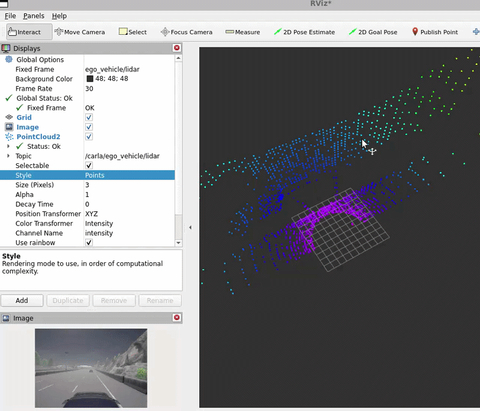
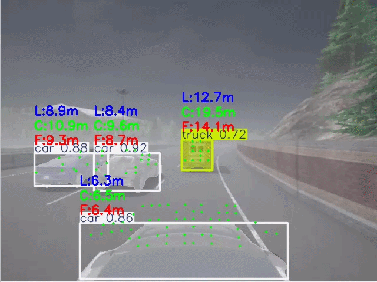
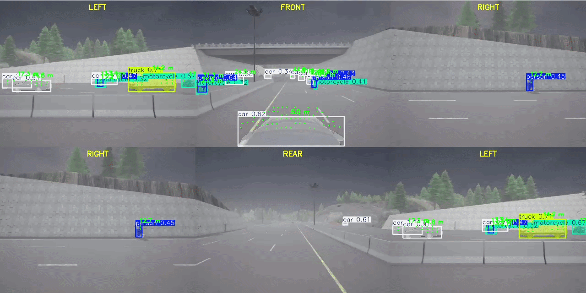
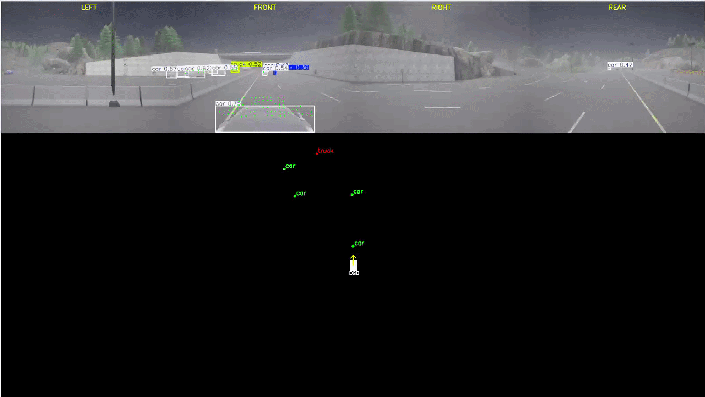
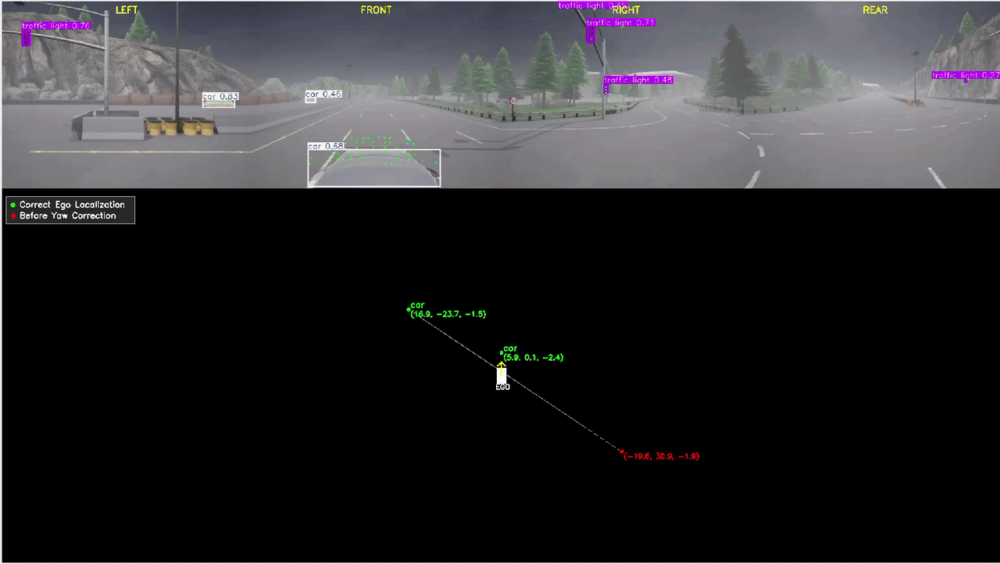
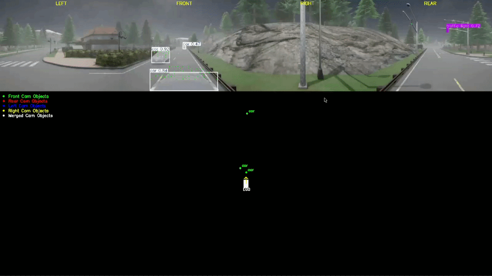
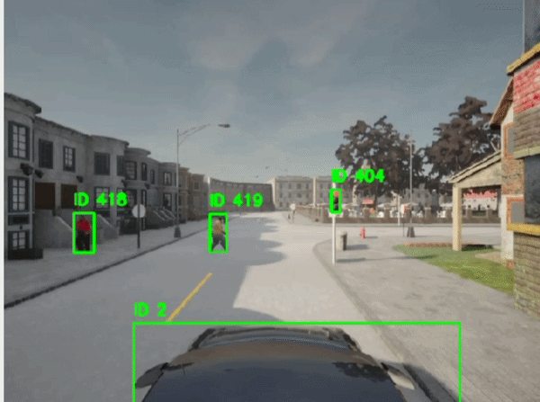
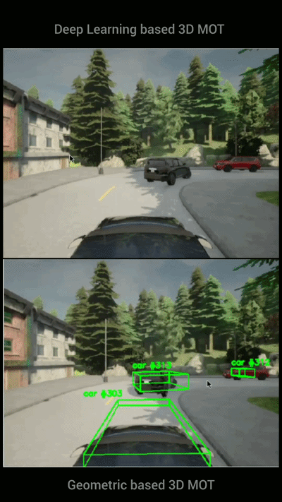
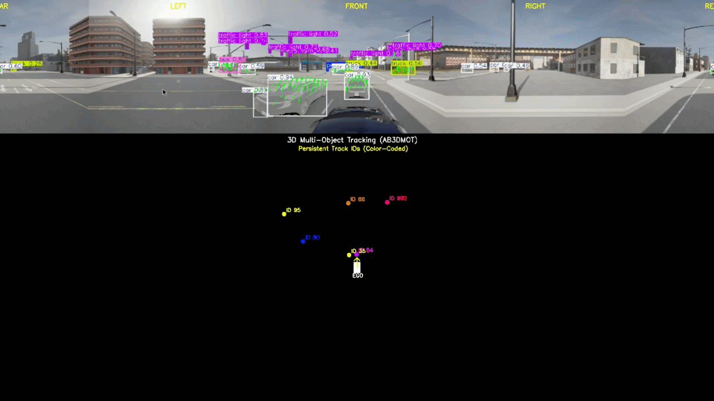

# Spatial Perception

A robotics perception engineering project focused on building **3D spatial understanding, multi-object tracking, and temporal perception** using synchronized RGB cameras and LiDAR.

Built using CARLA, ROS2, OpenCV, YOLO, and LiDAR-based 3D detection, the project progresses through camera–LiDAR integration, multi-camera perception, sensor fusion, unified spatial perception, cross-camera object association, and 2D/3D multi-object tracking, establishing a foundation for 360° environmental understanding and dynamic scene perception.

This project builds upon the 2D perception stack developed in the companion repository:

**ROS2 Autonomous Perception Stack** — [2D Perception](https://github.com/hamzafar/autonomous_perception)

---

## Technology Stack

| Category             | Technologies                     |
| -------------------- | -------------------------------- |
| Simulation           | CARLA 0.9.15                     |
| Robotics Middleware  | ROS2 Humble                      |
| Computer Vision      | OpenCV                           |
| Object Detection     | YOLOv8m-seg INT8 / YOLO26m FP16 |
| 3D Detection         | PointPillars / OpenPCDet         |
| 3D Tracking          | AB3DMOT                          |
| 3D Sensor            | LiDAR                            |
| Programming Language | Python                           |
| Communication        | CycloneDDS                       |
| Environment           | Windows 11 + WSL2 Ubuntu 22.04  |

---

## System Architecture

```text
RGB Cameras + LiDAR
          │
          ▼
Sensor Synchronization
          │
          ▼
Multi-Camera Perception
          │
          ▼
Camera–LiDAR Fusion
          │
          ▼
360° Panoramic Perception
          │
          ▼
Unified Spatial Perception
          │
          ▼
Cross-Camera Object Association
          │
          ▼
Unified World Representation
          │
          ▼
2D Multi-Object Tracking
          │
          ▼
3D Multi-Object Tracking
```
---

## Completed Phases

### ✅ Phase 7 — Sensor Fusion Foundations

Established the foundation for spatial perception by integrating LiDAR with RGB cameras, calibrating multi-sensor geometry, associating 2D detections with 3D point clouds, and preparing the perception pipeline for object-level distance estimation.

#### Milestones

- ✅ **7A — LiDAR Integration**
  - Integrated a 32-channel LiDAR sensor with the RGB perception pipeline.
  - Published synchronized `PointCloud2` data and validated real-time visualization.
  - 📁 [View Phase 7A](07_phase7_sensor_fusion_foundations/7A_lidar_integration/)

- ✅ **7B — Camera–LiDAR Calibration**
  - Calibrated RGB camera and LiDAR sensors using intrinsic and extrinsic parameters.
  - Implemented point cloud projection and verified exact timestamp synchronization.
  - 📁 [View Phase 7B](07_phase7_sensor_fusion_foundations/7B_camera_lidar_calibration/)

- ✅ **7C — 2D–3D Association**
  - Associated projected LiDAR points with YOLOv8 segmentation masks to generate object-specific point clouds.
  - Developed deterministic recording and offline replay pipelines for repeatable perception experiments.
  - 📁 [View Phase 7C](07_phase7_sensor_fusion_foundations/7C_2d_3d_association/)

- ✅ **7D — Object Distance Estimation**
  - LiDAR-based object distance estimation
  - Monocular distance estimation
  - Camera–LiDAR distance fusion
  - 📁 [View Phase 7D](07_phase7_sensor_fusion_foundations/7D_distance_estimation/)


---

### ✅ Phase 8 — Multi-Sensor Perception

Expanded the perception pipeline from a single forward-facing camera to a synchronized **360° multi-sensor perception system** by integrating multiple RGB cameras and LiDAR. This phase establishes the foundation for surround perception, multi-camera sensor fusion, and unified environmental understanding.

#### Milestones

- ✅ **8A — 360° Camera–LiDAR Perception**
  - Developed a synchronized 360° perception pipeline using four RGB cameras and a 32-channel LiDAR sensor.
  - Implemented deterministic recording, offline replay, multi-camera perception, and LiDAR projection for repeatable perception experiments.
  - 📁 [View Phase 8A](08_phase8_multi_sensor_perception/8A_360_camera_lidar_perception/)

- ✅ **8B — 360° Panoramic Distance Estimation**
  - Extended the 360° perception pipeline with panoramic image generation and LiDAR-based object distance estimation.
  - Implemented multi-camera object detection, camera–LiDAR projection, object-level point association, cylindrical panoramic stitching, and distance-aware surround visualization.
  - 📁 [View Phase 8B](08_phase8_multi_sensor_perception/8B_360_panoramic_distance_estimation/)

---

### ✅ Phase 9 — Unified Spatial Perception

Developed a unified spatial perception framework by transforming synchronized multi-camera detections and LiDAR observations into a common ego-centric world representation. This phase establishes the foundation for spatial scene understanding through object localization, Bird's-Eye View generation, and cross-camera object reasoning.

#### Milestones

- ✅ **9A — Unified Spatial Perception**
  - Localized detected objects from four synchronized RGB cameras into a unified ego coordinate frame using Camera–LiDAR fusion.
  - Generated a unified Bird's-Eye View (BEV) and validated coordinate transformations through camera-specific yaw correction.
  - 📁 [View Phase 9A](09_phase9_unified_spatial_perception/9A_unified_spatial_perception/)

- ✅ **9B — Cross-Camera Object Merging**
  - Associated duplicate object detections across overlapping camera views using bearing-based overlap filtering and Hungarian assignment.
  - Merged duplicate observations into a unified object representation for consistent 360° spatial perception.
  - 📁 [View Phase 9B](09_phase9_unified_spatial_perception/9B_cross_camera_object_merging/)

---

### 🚧 Phase 10 — Multi-Object Tracking

Extending the perception pipeline with temporal multi-object tracking using YOLO26m TensorRT FP16 and ByteTrack.

#### Milestones

- ✅ **10A — 2D Multi-Object Tracking**

  - Integrated YOLO26m TensorRT FP16 with the official ByteTrack implementation for persistent 2D object identities across consecutive frames.
  - Implemented track lifecycle management and tracking-focused visualization using synchronized offline replay data.
  - 📁 [View Phase 10A](10_phase10_multi_object_tracking/10A_2d_multi_object_tracking/)

- ✅ **10B — 3D Multi-Object Tracking**

  - Integrated geometry-based and PointPillars-based 3D detection with AB3DMOT for persistent 3D object tracking.
  - Enabled modular comparison of 3D detection approaches using a common tracking and visualization framework.
  - 📁 [View Phase 10B](10_phase10_multi_object_tracking/10B_3d_multi_object_tracking/)

- ✅ **10C — Multi-Camera 3D Multi-Object Tracking**

  - Extended 3D tracking to four synchronized RGB cameras and LiDAR with geometric cross-camera association and duplicate object merging.

  - Integrated AB3DMOT to maintain persistent 3D Track IDs across the unified 360° ego-centric scene.

  - 📁 [View Phase 10C](10_phase10_multi_object_tracking/10C_multi_camera_3d_multi_object_tracking/)
--- 

### 🚧 Phase 11 Motion Estimation
  - Documentation will be published after project milestone release.

#### Milestones

- ✅ **11A — Ego Motion Estimation**
- ✅ **11B — Ego Surrounding Object Motion Estimation**

---
## Demonstrations

<h2 align="center">Phase 7 — Sensor Fusion Foundations</h2>

<h3 align="center">7A — LiDAR Integration</h3>

<p align="center">
  
</p>

<p align="center">
Integrated a 32-channel LiDAR sensor into the ROS2 perception pipeline and validated synchronized PointCloud2 visualization in RViz2.
</p>

---

<h3 align="center">7B — Camera–LiDAR Calibration</h3>

<p align="center">
  
</p>

<p align="center">
Projected LiDAR points onto synchronized RGB images through camera calibration, coordinate transformation, and perspective projection.
</p>

---

<h3 align="center">7C — 2D–3D Association</h3>

<p align="center">
  
</p>

<p align="center">
Associated projected LiDAR points with YOLOv8 segmentation masks to generate object-specific point clouds using a deterministic offline replay pipeline.
</p>

---

<h3 align="center">7D — Object Distance Estimation</h3>

<p align="center">
  
</p>

<p align="center">
Estimated object distances using monocular camera geometry, LiDAR point clouds, and camera–LiDAR sensor fusion.
</p>

---

<h3 align="center">8A — 360° Camera–LiDAR Perception</h3>

<p align="center">
  
</p>

<p align="center">
Established a synchronized 360° perception pipeline using four RGB cameras and LiDAR with deterministic recording, offline replay, and unified surround-view perception.
</p>

---

<h3 align="center">8B — 360° Panoramic Distance Estimation</h3>

<p align="center">
  
</p>

<p align="center">
Extended the 360° Camera–LiDAR perception pipeline with panoramic image generation, LiDAR-based object distance estimation, and distance-aware surround visualization using synchronized multi-camera perception.
</p>

---

<h3 align="center">BEV Generation</h3>

<p align="center">
  
</p>

<p align="center">
Unified spatial perception with ego-coordinate object localization and Bird's-Eye View generation from synchronized multi-camera and LiDAR observations.
</p>


<h3 align="center">Camera Yaw Correction & BEV Validation</h3>

<p align="center">
  
</p>

<p align="center">
Bird's-Eye View visualization used to validate ego-coordinate transformations and correct left and right camera yaw, resulting in consistent object localization across all synchronized camera views.
</p>

<h3 align="center">Cross-Camera Object Association</h3>

<p align="center">
  
</p>

<p align="center">
Associated duplicate object detections across overlapping camera views using bearing-based overlap filtering and Hungarian assignment.
</p>

<h3 align="center">2D Multi-Object Tracking</h3>

<p align="center">
  
</p>

<p align="center">
Persistent 2D object identities maintained across consecutive frames using YOLO26m TensorRT FP16 and ByteTrack on synchronized offline replay data.
</p>

<h3 align="center">3D Multi-Object Tracking</h3>

<p align="center">
  
</p>

<p align="center">
Persistent 3D object identities maintained across consecutive LiDAR frames using PointPillars 3D detection and AB3DMOT tracking with synchronized front-camera visualization.
</p>

<h3 align="center">Multi-Camera 3D Multi-Object Tracking</h3>

<p align="center">
  
</p>

<p align="center">
Unified 360° 3D object tracking using four synchronized RGB cameras, LiDAR, geometric cross-camera association, and AB3DMOT with persistent 3D Track IDs.
</p>

---
<!-- 
## Future Work

Planned areas of development include:

- Multi-camera perception
- 360° environment perception
- Unified world representation
- Bird's-Eye View generation
- Multi-camera overlap resolution
- Spatial perception evaluation -->
---

## Project Journal

Detailed planning, development notes, experiments, and engineering decisions are maintained separately:

- `roadmap/README.md`