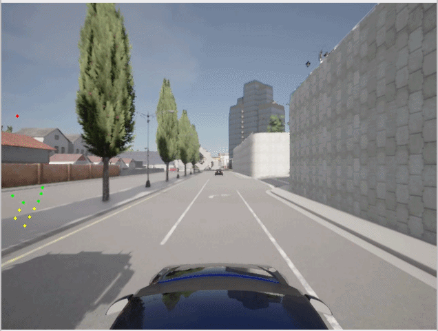
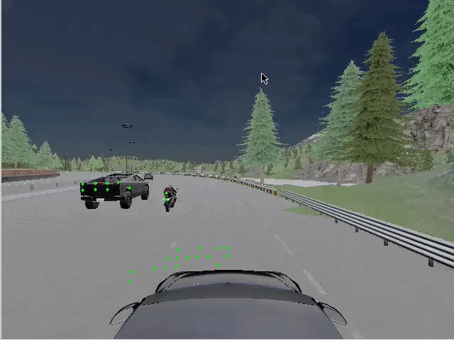

Prerequisite:

This project builds upon the 2D perception stack developed in:

ROS2 Autonomous Perception Stack — [2D Perception](https://github.com/hamzafar/autonomous_perception)

# Phase 7 — Sensor Fusion & 3D Perception Foundations

## Objectives

Extend the perception stack beyond monocular vision by integrating LiDAR data and basic sensor fusion techniques.

Question: What is this object and how far away is it in 3D World?


## 7.1 LiDAR Integration

### Tasks

- Add LiDAR sensor to CARLA vehicle (completed)
- Publish LiDAR point clouds through ROS2 (completed)
- Visualize point cloud data (completed)


### Focus Areas

- Point cloud processing

### Deliverable

<p align="center">
  
</p>

<p align="center">
  CARLA Online RGB Camera + LiDAR Integration
</p>

# 7.2 Camera–LiDAR Calibration & Projection

## Tasks

- Extract camera intrinsic parameters (completed)
- Extract LiDAR extrinsic parameters (completed)
- Validate camera–LiDAR synchronization (completed)
- Transform LiDAR points into camera coordinates (completed)
- Project LiDAR points onto image plane (completed)
- Visualize projected LiDAR points on RGB images (completed)

## Completed

- ✅ Camera intrinsics extracted from ROS2 CameraInfo
- ✅ Camera matrix validated
- ✅ LiDAR extrinsics derived from CARLA sensor configuration
- ✅ ROS2 TimeSynchronizer implemented
- ✅ Exact camera–LiDAR timestamp synchronization verified
- ✅ PointCloud2 parsing implemented
- ✅ LiDAR → camera coordinate transformation implemented
- ✅ Perspective projection implemented
- ✅ Image bounds filtering implemented
- ✅ OpenCV overlay visualization implemented
- ✅ Depth-colored projection visualization implemented

## Camera Configuration

Topic:
- `/carla/ego_vehicle/rgb_front/image`

Resolution:
- 640 × 480

FOV:
- 90°

Position:
- x = -1.5
- y = 0.0
- z = 2.4

## LiDAR Configuration

Topic:
- `/carla/ego_vehicle/lidar`

Position:
- x = 0.0
- y = 0.0
- z = 2.4

Parameters:
- Range: 50 m
- Channels: 32
- Points/sec: 56000
- Rotation Frequency: 10 Hz

## Camera Intrinsics

fx = 320.0

fy = 320.0

cx = 320.0

cy = 240.0

Camera Matrix:

| 320 | 0 | 320 |
|------|------|------|
| 0 | 320 | 240 |
| 0 | 0 | 1 |

## Synchronization Validation

Used:

- ROS2 `message_filters.TimeSynchronizer`

Results:

```text
Image TS : 3045.320203
LiDAR TS : 3045.320203
Delta    : 0.000 ms
```

### Deliverable

<p align="center">
  
</p>

<p align="center">
  CARLA Online RGB Camera + LiDAR Integration
</p>


## 7.3 2D–3D Association

### Tasks

- Run YOLOv8m-seg TensorRT perception pipeline (completed)
- Associate projected LiDAR points with detected objects (completed)
- Filter object-specific point clusters using segmentation masks (completed)
- Record synchronized camera–LiDAR data (completed)
- Build deterministic camera–LiDAR dataset (completed)
- Implement ROS2 camera–LiDAR replay publisher (completed)
- Validate object association on recorded datasets (completed)

## Completed

- ✅ YOLOv8m-seg TensorRT inference integrated
- ✅ Segmentation mask extraction implemented
- ✅ Projected LiDAR points associated with segmented objects
- ✅ Object-specific LiDAR point filtering implemented
- ✅ CARLA synchronous recording pipeline implemented
- ✅ Synchronized camera–LiDAR dataset generation implemented
- ✅ Camera image recording implemented
- ✅ LiDAR point cloud recording implemented
- ✅ Frame-level timestamp logging implemented
- ✅ Deterministic offline replay pipeline implemented
- ✅ ROS2 Image publisher implemented
- ✅ ROS2 PointCloud2 publisher implemented
- ✅ Adjustable replay FPS implemented
- ✅ Exact camera–LiDAR timestamp synchronization during replay verified
- ✅ Existing perception pipeline validated on replayed datasets
- ✅ Repeatable offline testing workflow established


### Deliverable
<p align="center">
  
</p>

<p align="center">
  Offline detection point clouds
</p>

## 7.4 Monocular vs LiDAR vs Sensor Fusion Distance

### Tasks

- Compute Monocular Camera Distance (completed)
- Compute LiDAR Distance (completed)
- Compute Sensor Fusion (Camera + LiDAR) Distance (completed)

### Completed

- ✅ Monocular camera distance estimation implemented
- ✅ LiDAR distance estimation using object-specific LiDAR point clusters implemented
- ✅ Camera and LiDAR distance visualization integrated into perception pipeline
- ✅ Weighted camera–LiDAR fusion distance estimation implemented
- ✅ Object-level distance estimation validated on synchronized camera–LiDAR streams
- ✅ End-to-end RGB + LiDAR distance estimation pipeline established

### Focus Areas

- Monocular geometric distance estimation
- LiDAR-based object range estimation
- Camera–LiDAR sensor fusion
- Object-level metric scene understanding
- Multi-modal perception validation

### Deliverable
<p align="center">
  
</p>

<p align="center">
  Camera, LiDAR, and Fused Distance Estimation
</p>

<!-- ## 7.5 3D Semantic Bird Eye View(BEV)

### Tasks

- Deterministic 4 cameras and LiDAR Recording (completed)
- Generate 360 degree camera view
- Project Lidar points on 360 Image View
- Perform detection and extract objects point clouds
- Estimate Distance of surronding objects
- Generate BEV
- Unified world representation
- Object localization in world coordinates
- Scene-level perception analysis

### Goal

Transition from 2D perception toward 3D scene understanding.


## 7.6 Benchmarking & Analysis

### Comparison

| Pipeline | Detection | Distance Estimation | Spatial Awareness |
|-----------|-----------|-----------|-----------|
| Camera Only | ✓ | ✗ | Limited |
| Camera + LiDAR | ✓ | ✓ | Improved |

### Metrics

- Distance estimation accuracy
- Sensor synchronization stability
- Fusion processing latency
- Perception throughput


## Deliverables

- ROS2 LiDAR integration
- Camera-LiDAR calibration pipeline
- Distance-aware object detection
- Sensor fusion perception pipeline
- Basic 3D perception framework
- Fusion benchmarking report
- Multi-modal perception demonstration


## Outcome

Transition from camera-only perception toward multi-modal robotics perception. -->
---

# Phase 8 — 360° Multi-Sensor Perception

## Architecture

```text
                 Replay Node
  (Publishes 5 sensor topics, cameras, lidar)
                     │
                     ▼
            Synchronization Node
     (Receive & validate all sensors)
                     │
                     ▼
             Perception Node
      ├── Stitch images
      ├── YOLO inference
      ├── LiDAR projection
      ├── 2D–3D association
      ├── Distance estimation
      └── BEV (later)
                     │
                     ▼
           Visualization Node
     (Display images, overlays, FPS, BEV)

```

## Objectives

Expand perception coverage using multiple synchronized cameras.

Question: Can I perceive my surroundings in all directions in 3D World?


### Tasks

- Multi-camera ROS2 integration (completed)
- Camera synchronization (completed)
- Multi-stream visualization (completed)
- Unified perception visualization (completed)
- Multi-camera object detection (completed)
- Project LiDAR onto all camera views (completed)
- Perform detection and extract objects point clouds (completed)
- Estimate Distance of surronding objects (completed)

## Completed

- ✅ Multi-camera (front, rear, left, right) ROS2 perception pipeline implemented
- ✅ 360° synchronized multi-camera perception established
- ✅ Camera–LiDAR projection implemented for all camera views
- ✅ Multi-camera 2D–3D object association implemented
- ✅ Object-specific LiDAR point cloud extraction implemented
- ✅ Per-object LiDAR distance estimation across all camera views implemented
- ✅ Unified 360° perception visualization with detections, point clouds, and distance overlays integrated
- ✅ End-to-end 360° camera–LiDAR perception pipeline established


## Deliverables


---
# Phase 9 — Advanced Multi-Modal Perception

## Objectives

Combine camera, LiDAR, and multi-camera perception into a unified perception system.

Question : Where is everything relative to me in a unified world representation?

# Phase 9.1 - Unified Spatial Perception

### Tasks

- Objects localization in the ego coordinate frame (completed)
- Unified world representation (completed)
- Bird's-Eye View generation (completed)


## Deliverables

# Phase 9.2

### Tasks

- Improvement to phase9.1
- Overlapping field-of-view analysis
- merge object if seeing twice in cameras intersection
- compare it in bev, 9.1 and 9.2


## Deliverables

# Phase 9.3

### Tasks

- how good is perception.
- identify each object differently (may be yolo instance segmentation)
- get ground truth distances from the Carla simulator
- compare it with the  phase 9.2/phase9.1
- and check the difference


## Deliverables

## Outcome

Build a complete multi-modal perception stack resembling modern autonomous systems.

---
# Phase 9-10 — Optimization & Final Evaluation

Once the full multi-camera + LiDAR system is in place:

Evaluate distance against ground truth.
Compare single-camera vs multi-camera vs fused estimates.
Analyze how BEV/world representation affects localization.
Optimize the distance estimation strategy if needed.

Which object is which over time? deepsort etc..


---

# Phase 10 — Edge Inference Readiness & Deployment

## Objectives

Deploy the optimized perception stack on embedded edge hardware.


## Target Platforms

- NVIDIA Jetson Nano
- NVIDIA Jetson Xavier NX
- NVIDIA Jetson Orin Nano


## 10.1 Deployment Preparation

### Tasks

- Containerize perception pipeline
- Prepare deployment scripts
- Package ROS2 perception nodes
- Validate TensorRT deployment workflow


## 10.2 Edge Optimization

### Tasks

- Optimize memory usage
- Optimize power consumption
- Tune TensorRT inference settings
- Analyze thermal behavior
- Evaluate deployment constraints


## 10.3 Edge Benchmarking

### Comparison

| Platform | FPS | Latency | GPU Utilization | Memory Usage |
|-----------|-----|----------|----------------|--------------|
| Desktop GPU | | | | |
| Jetson Nano | | | | |
| Xavier NX | | | | |
| Orin Nano | | | | |

### Metrics

- Real-time FPS
- End-to-end latency
- Memory footprint
- Power efficiency
- Thermal stability


## 10.4 Deployment Validation

### Tasks

- Continuous perception testing
- Long-duration stability testing
- Resource monitoring
- Failure analysis


## Deliverables

- Edge deployment workflow
- TensorRT deployment package
- Containerized perception stack
- Edge benchmarking report
- Embedded deployment guide


## Outcome

Deploy a robotics perception system on real edge hardware with validated real-time performance.

---
# Phase 11 — ViT-Based Detection Extension

## Tasks
- Integrate transformer-based detector

## Comparison
- Accuracy
- FPS
- Latency
- Edge suitability

## Deliverable
- CNN vs ViT perception comparison

---

# Final Deliverables

- GitHub repository
- Demo video
- Benchmark report
- ROS2 modular perception stack
- CNN vs ViT comparison
